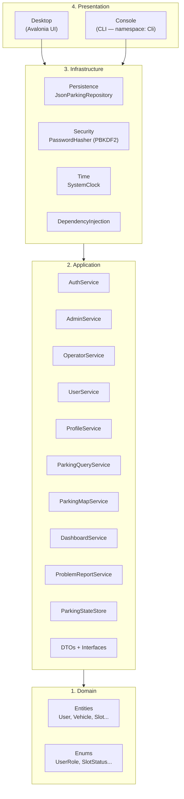
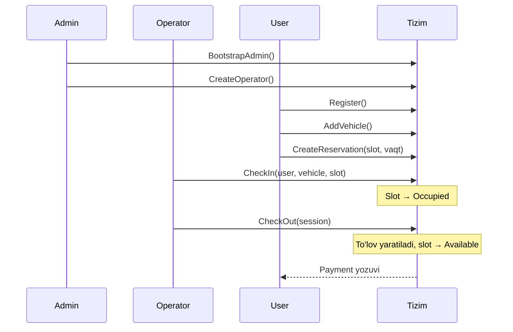

# Smart Parking Management System (Parking Tizimi)

**PBL 2** universitet loyihasi — zamonaviy parking boshqaruv tizimi.

Clean Architecture, Domain-Driven Design (DDD) tamoyillari va **.NET 8** asosida qurilgan. Biznes mantiq **Application** qatlamida markazlashtirilgan; **Avalonia Desktop** va **Konsol (CLI)** interfeyslari faqat presentation vazifasini bajaradi.

---

## Mundarija

1. [Umumiy ko'rinish](#umumiy-ko'rinish)
2. [Texnologiyalar](#texnologiyalar)
3. [Asosiy imkoniyatlar](#asosiy-imkoniyatlar)
4. [Arxitektura](#arxitektura)
5. [Loyiha strukturasi](#loyiha-strukturasi)
6. [Domain modeli](#domain-modeli)
7. [Application qatlami](#application-qatlami)
8. [Autentifikatsiya va profil](#autentifikatsiya-va-profil)
9. [Rollar va ruxsatlar](#rollar-va-ruxsatlar)
10. [Desktop interfeysi](#desktop-interfeysi)
11. [Konsol (CLI) interfeysi](#konsol-cli-interfeysi)
12. [Biznes oqimi](#biznes-oqimi)
13. [Geo-qidiruv va tariflar](#geo-qidiruv-va-tariflar)
14. [To'lov hisoblash](#to'lov-hisoblash)
15. [Muammo xabar qilish](#muammo-xabar-qilish)
16. [Demo ma'lumotlar](#demo-ma'lumotlar)
17. [Ma'lumotlarni saqlash](#ma'lumotlarni-saqlash)
18. [Ishga tushirish](#ishga-tushirish)
19. [Testlar](#testlar)
20. [Muhit o'zgaruvchilari](#muhit-o'zgaruvchilari)
21. [Muammolarni bartaraf etish](#muammolarni-bartaraf-etish)
22. [Best practices](#best-practices)
23. [Rivojlantirish yo'li](#rivojlantirish-yo'li)
24. [Litsenziya](#litsenziya)

---

## Umumiy ko'rinish

Parking Tizimi — ko'p rolli (Admin, Operator, User, Mehmon) parking boshqaruv platformasi. Foydalanuvchilar avtomobil qo'shadi, slot bron qiladi; operatorlar check-in/check-out bajaradi; adminlar tizimni nazorat qiladi, statistika va hisobotlarni ko'radi.

Loyiha quyidagi prinsiplarga amal qiladi:

- **Clean Architecture** — qatlamlar bir-biriga faqat ichkaridan bog'lanadi
- **Single Responsibility** — har bir servis bitta vazifaga mas'ul
- **Rol-based access control** — ruxsatlar servis qatlamida tekshiriladi (UI ga ishonilmaydi)
- **OperationResult pattern** — xatolar strukturali qaytariladi, exception spam yo'q
- **Geo-parking** — Haversine formulasi orqali yaqin parking hududlarini qidirish

---

## Texnologiyalar

| Texnologiya | Versiya / tavsif |
|-------------|------------------|
| .NET SDK | 8.0.422 (`global.json`) |
| C# | 12 (nullable enabled) |
| Avalonia UI | 12.0.4 (Desktop) |
| Microsoft.Extensions.DependencyInjection | 8.0.1 |
| Ma'lumotlar bazasi | JSON fayl (`data/parking-data.json`) |
| Parol hash | PBKDF2-SHA256, 100 000 iteratsiya |
| Test framework | xUnit |

**Platformalar:** Linux, Windows, macOS

---

## Asosiy imkoniyatlar

| Bo'lim | Imkoniyat |
|--------|-----------|
| **Autentifikatsiya** | Birinchi admin sozlash, login, user ro'yxatdan o'tish |
| **Profil** | Telefon yangilash, parol o'zgartirish |
| **Parking xaritasi** | 120+ hudud, geo-xarita, yaqin joylarni qidirish |
| **Slot boshqaruvi** | Available / Reserved / Occupied / OutOfService holatlari |
| **Bron** | Vaqt oralig'i bilan slot band qilish, bekor qilish |
| **Operatsiya** | Operator check-in / check-out, avtomatik to'lov |
| **Tariflar** | Har hudud/slot uchun soatlik stavka (4000–8750 UZS) |
| **Dashboard** | Bandlik %, daromad, 7 kunlik grafik, rolga mos statistika |
| **Hisobotlar** | Admin uchun moliyaviy va operatsion ko'rinish |
| **Muammolar** | Foydalanuvchi xabar beradi, admin yopadi |
| **Demo rejim** | Bir bosishda 100+ dan har bir turdagi ma'lumot |

---

## Arxitektura

Loyiha 4 ta qatlamga ajratilgan. Tashqi qatlamlar ichkariga bog'lanadi; **Domain** hech narsaga bog'lanmaydi.



### Qatlamlar vazifasi

| Qatlam | Vazifa | Bog'lanish |
|--------|--------|------------|
| **Domain** | Biznes obyektlari, enumlar | Hech narsaga bog'lanmaydi |
| **Application** | Use-case servislar, DTO, interfeyslar | Faqat Domain |
| **Infrastructure** | JSON saqlash, parol hash, vaqt, DI | Application interfeyslarini implement qiladi |
| **Presentation** | UI, foydalanuvchi bilan ishlash | Infrastructure orqali `ParkingAppServices` ni chaqiradi |

### Kirish nuqtasi — `ParkingAppServices`

Presentation qatlamlari barcha servislarga **facade** orqali kiradi:

```csharp
ParkingAppServices
├── StateStore      → IParkingStateStore
├── Auth            → IAuthService
├── Admin           → IAdminService
├── Operator        → IOperatorService
├── User            → IUserService
├── Profile         → IProfileService
├── CurrentUser     → ICurrentUserService
├── Query           → IParkingQueryService
├── Map             → IParkingMapService
├── Dashboard       → IDashboardService
└── Problems        → IProblemReportService
```

---

## Loyiha strukturasi

```
ParkingTizimi/
├── ParkingTizimi.sln
├── global.json                          # .NET SDK 8.0.422
├── run-desktop.sh                       # Desktop ishga tushirish
├── run-console.sh                       # CLI ishga tushirish
├── LICENSE
├── README.md
├── data/
│   └── parking-data.json                # Runtime da yaratiladi (gitignore)
│
├── src/
│   ├── Domain/                          # 1. Domain
│   │   ├── Entities/
│   │   │   ├── User.cs
│   │   │   ├── Vehicle.cs
│   │   │   ├── ParkingZone.cs
│   │   │   ├── ParkingSlot.cs
│   │   │   ├── Reservation.cs
│   │   │   ├── ParkingSession.cs
│   │   │   ├── Payment.cs
│   │   │   └── ProblemReport.cs
│   │   └── Enums/
│   │       ├── UserRole.cs
│   │       ├── SlotStatus.cs
│   │       ├── ReservationStatus.cs
│   │       ├── PaymentStatus.cs
│   │       └── ProblemStatus.cs
│   │
│   ├── Application/                     # 2. Application
│   │   ├── Common/
│   │   │   └── OperationResult.cs
│   │   ├── DTOs/
│   │   │   ├── Auth/                    # LoginRequest, RegisterRequest, AuthResult
│   │   │   ├── Profile/                 # UpdateProfileRequest, ChangePasswordRequest
│   │   │   ├── Map/                     # ZoneAvailabilityDto, ZoneSlotDto, ...
│   │   │   ├── Dashboard/               # DashboardOverviewDto, ZoneStatDto, ...
│   │   │   └── Problems/                # ReportProblemRequest, ProblemReportDto
│   │   ├── Interfaces/                  # IAuthService, IAdminService, ...
│   │   ├── Services/                    # AuthService, AdminService, ...
│   │   ├── Internal/
│   │   │   ├── DemoDataSeeder.cs        # Katta demo to'plam
│   │   │   ├── ParkingStateHelper.cs
│   │   │   ├── UserRegistration.cs
│   │   │   ├── GeoHelper.cs             # Haversine masofa
│   │   │   ├── PhoneNumberValidator.cs
│   │   │   └── InputNormalizer.cs
│   │   ├── Models/
│   │   │   └── ParkingState.cs          # Barcha kolleksiyalar
│   │   ├── DependencyInjection/
│   │   └── ParkingAppServices.cs        # Facade
│   │
│   ├── Infrastructure/                  # 3. Infrastructure
│   │   ├── Persistence/
│   │   │   └── JsonParkingRepository.cs
│   │   ├── Security/
│   │   │   └── PasswordHasher.cs
│   │   ├── Time/
│   │   │   └── SystemClock.cs
│   │   └── DependencyInjection/
│   │
│   ├── Desktop/                         # 4. Presentation — Avalonia
│   │   ├── App.axaml / App.axaml.cs
│   │   ├── MainWindow.axaml / .cs       # Asosiy UI (14+ sahifa)
│   │   ├── ParkingFloorRenderer.cs      # A/B/C qatorli slot grid
│   │   ├── ZoneMapRenderer.cs           # Geo-xarita chizish
│   │   ├── ProblemReportWindow.axaml    # Muammo xabar dialogi
│   │   └── Program.cs
│   │
│   └── Console/                         # 4. Presentation — CLI
│       └── Program.cs                   # namespace: Cli
│
└── tests/
    └── Application.Tests/
        └── ParkingApplicationTests.cs   # 12 ta unit test
```

---

## Domain modeli

### Entitylar

| Entity | Asosiy maydonlar | Tavsif |
|--------|------------------|--------|
| **User** | Username, PasswordHash, Phone, Role, IsActive | Tizim foydalanuvchisi |
| **Vehicle** | OwnerUserId, PlateNumber, Model, Color | Foydalanuvchi avtomobili |
| **ParkingZone** | Code, Name, District, Address, Lat/Lng | Parking hududi |
| **ParkingSlot** | ZoneId, Code, Status, HourlyRate | Aniq park joyi |
| **Reservation** | UserId, VehicleId, SlotId, From/To, Status | Oldindan bron |
| **ParkingSession** | UserId, VehicleId, SlotId, CheckIn/Out, TotalAmount | Faol/yopilgan sessiya |
| **Payment** | SessionId, Amount, Status, PaidAtUtc | To'lov yozuvi |
| **ProblemReport** | ReporterUserId, ZoneId, SlotCode, Title, Status | Muammo xabari |

### Enumlar

| Enum | Qiymatlar |
|------|-----------|
| **UserRole** | Admin, Operator, User |
| **SlotStatus** | Available, Reserved, Occupied, OutOfService |
| **ReservationStatus** | Active, Completed, Cancelled |
| **PaymentStatus** | Pending, Paid, Failed |
| **ProblemStatus** | Open, InProgress, Resolved |

### `ParkingState` — markaziy holat

Barcha ma'lumotlar bitta `ParkingState` obyektida saqlanadi:

```csharp
ParkingState
├── Users
├── Vehicles
├── Zones
├── Slots
├── Reservations
├── Sessions
├── Payments
├── ProblemReports
└── DefaultHourlyRate (5000 UZS)
```

---

## Application qatlami

### Servislar xaritasi

| Servis | Interfeys | Asosiy metodlar |
|--------|-----------|-----------------|
| **AuthService** | `IAuthService` | `Login`, `Register`, `HasAdmin` |
| **AdminService** | `IAdminService` | `BootstrapAdmin`, `CreateOperator`, `SetSlotStatus` |
| **OperatorService** | `IOperatorService` | `CheckIn`, `CheckOut` |
| **UserService** | `IUserService` | `AddVehicle`, `CreateReservation`, `CancelReservation`, `GetUserVehicles/Payments` |
| **ProfileService** | `IProfileService` | `GetProfile`, `UpdateProfile`, `ChangePassword` |
| **ParkingQueryService** | `IParkingQueryService` | `GetSlots`, `GetAllUsers`, `GetPayments`, `FindUserByUsername`, ... |
| **ParkingMapService** | `IParkingMapService` | `GetAllZonesWithAvailability`, `SearchNearbyZones`, `GetZoneSlots` |
| **DashboardService** | `IDashboardService` | `GetOverview` — statistika, daromad, zona bandligi |
| **ProblemReportService** | `IProblemReportService` | `Report`, `GetOpenReports`, `GetAllReports`, `Resolve` |
| **ParkingStateStore** | `IParkingStateStore` | `InitializeAsync`, `PersistAsync` — yuklash/saqlash |
| **CurrentUserService** | `ICurrentUserService` | `SetCurrentUser`, `SignOut` — sessiya holati |

### `OperationResult<T>`

Barcha biznes operatsiyalar natijasi strukturali:

```csharp
// Muvaffaqiyat
OperationResult<AuthResult>.Success(authResult);

// Xato
OperationResult<AuthResult>.Failure("Foydalanuvchi topilmadi.");
```

---

## Autentifikatsiya va profil

### Autentifikatsiya oqimi

```
Mehmon
  │
  ├─► Setup / BootstrapAdmin (faqat bir marta, admin yo'q bo'lsa)
  │
  ├─► Login ──► AuthService.Login ──► CurrentUserService.SetCurrentUser
  │
  └─► Register (faqat admin mavjud bo'lsa) ──► UserRole.User
```

### Xavfsizlik qoidalari

| Qoida | Tavsif |
|-------|--------|
| Parol hash | PBKDF2-SHA256, 100 000 iteratsiya — plain-text saqlanmaydi |
| Telefon | `+998XXXXXXXXX` (9 raqam, jami 13 belgi) |
| Parol uzunligi | Kamida 6 belgi |
| Register | Admin mavjud bo'lgandagina ishlaydi |
| Rol tekshiruvi | Servis qatlamida (`ParkingStateHelper.IsAdmin/IsOperator/IsEndUser`) |

### Profil operatsiyalari

| Metod | Vazifa |
|-------|--------|
| `GetProfile` | Joriy foydalanuvchi ma'lumotlari |
| `UpdateProfile` | Telefon raqamni yangilash |
| `ChangePassword` | Joriy parolni tekshirib, yangisini o'rnatish |

---

## Rollar va ruxsatlar

### Rollar ierarxiyasi

```
Admin (Ma'mur)
  │
  ├── Operator yaratadi
  │     │
  │     └── Check-in / Check-out bajaradi
  │
  └── Tizimni nazorat qiladi (foydalanuvchilar, slotlar, statistika, muammolar)

User (Foydalanuvchi)
  │
  ├── O'zi ro'yxatdan o'tadi (admin mavjud bo'lgandan keyin)
  ├── Avtomobil qo'shadi
  ├── Bron yaratadi / bekor qiladi
  └── To'lovlar tarixini ko'radi

Mehmon (Guest)
  │
  ├── Dashboard, parking, tariflar, muammolarni ko'radi
  ├── Login / Register / Setup sahifalariga kiradi
  └── Operatsion amallarni bajara olmaydi
```

> **Muhim:** Admin check-in/out **bajarmaydi**. Operator admin panelini **ko'rmaydi**. User faqat o'z ma'lumotlari bilan ishlaydi.

### Servis darajasidagi ruxsatlar

| Amal | Admin | Operator | User | Mehmon |
|------|:-----:|:--------:|:----:|:------:|
| Bootstrap admin | ✅ (bir marta) | ❌ | ❌ | ✅ |
| Login | ✅ | ✅ | ✅ | ✅ |
| Register (User) | ❌ | ❌ | ❌ | ✅* |
| Operator yaratish | ✅ | ❌ | ❌ | ❌ |
| Avtomobil qo'shish | ❌ | ❌ | ✅ | ❌ |
| Bron yaratish/bekor | ❌ | ❌ | ✅ | ❌ |
| Check-in | ❌ | ✅ | ❌ | ❌ |
| Check-out | ❌ | ✅ | ❌ | ❌ |
| Profil yangilash | ✅ | ✅ | ✅ | ❌ |
| Slot OutOfService | ✅ | ❌ | ❌ | ❌ |
| Muammo yopish | ✅ | ❌ | ❌ | ❌ |
| Barcha foydalanuvchilar | ✅ | ❌ | ❌ | ❌ |

*\* Register faqat admin mavjud bo'lganda ishlaydi.*

### Desktop navigatsiya (rol bo'yicha)

| Sahifa | Mehmon | User | Operator | Admin |
|--------|:------:|:----:|:--------:|:-----:|
| Dashboard | ✅ | ✅ | ✅ | ✅ |
| Parking joylar | ✅ | ✅ | ✅ | ✅ |
| Bron | ❌ | ✅ | ❌ | ❌ |
| Tariflar | ✅ | ✅ | ✅ | ✅ |
| To'lovlar | ❌ | ✅ (o'z) | ❌ | ✅ (barcha) |
| Hisobotlar | ❌ | ❌ | ❌ | ✅ |
| Sessiyalar | ❌ | ❌ | ✅ | ✅ |
| Muammolar | ✅ | ✅ | ✅ | ✅ |
| Foydalanuvchilar | ❌ | ❌ | ❌ | ✅ |
| Operator panel | ❌ | ❌ | ✅ | ❌ |
| Admin panel | ❌ | ❌ | ❌ | ✅ |
| Profil | ❌ | ✅ | ✅ | ✅ |
| Sozlash | ✅** | ❌ | ❌ | ❌ |
| Login / Register | ✅ | ❌ | ❌ | ❌ |

*\*\* Sozlash faqat admin yo'q va login qilinmagan holatda.*

Sidebar bo'limlari: **ASOSIY** · **MOLIYA** · **OPERATSIYA** · **BOSHQARUV** · **HISOB**

---

## Desktop interfeysi

Avalonia 12 asosidagi zamonaviy UI — binafsha (`#6366F1`) tema, sidebar navigatsiya, rolga mos dashboard.

### Sahifalar

| Sahifa | Tavsif |
|--------|--------|
| **Sozlash (Setup)** | Birinchi admin yaratish — username, parol, telefon |
| **Login** | Mavjud hisobga kirish |
| **Register** | Yangi User ro'yxatdan o'tish |
| **Dashboard** | Rolga mos statistika kartochkalari, geo-xarita, 7 kunlik daromad |
| **Parking joylar** | Zona pilllari, A/B/C qatorli slot grid (`ParkingFloorRenderer`) |
| **Bron** | Geo-qidiruv, zona/slot tanlash, bron yaratish va bekor qilish |
| **Tariflar** | Barcha hududlar bo'yicha soatlik stavkalar ro'yxati |
| **To'lovlar** | User — o'z to'lovlari; Admin — barcha to'lovlar |
| **Hisobotlar** | Admin moliyaviy va operatsion hisobotlar |
| **Sessiyalar** | Faol va yopilgan parking sessiyalari |
| **Muammolar** | Ochiq muammolar ro'yxati, yangi xabar, admin yopish |
| **Foydalanuvchilar** | Admin — barcha userlar ro'yxati |
| **Operator panel** | Check-in / check-out ComboBox orqali |
| **Admin panel** | Operator yaratish, slot OutOfService |
| **Profil** | Telefon va parol yangilash |

### Rolga mos Dashboard

| Rol | Dashboard kontenti |
|-----|------------------|
| **Admin** | Umumiy bandlik, daromad, barcha zonalar statistikasi, xarita |
| **Operator** | Faol sessiyalar, bugungi operatsiyalar |
| **User** | O'z bronlari, to'lovlar, yaqin parking joylari |
| **Mehmon** | Umumiy ko'rinish — bandlik va xarita (shaxsiy ma'lumotsiz) |

### Vizual komponentlar

- **`ParkingFloorRenderer`** — slotlarni A/B/C qatorlari bilan grid ko'rinishida chizadi (Available / Occupied / Reserved / OutOfService ranglari)
- **`ZoneMapRenderer`** — dashboard xaritasida zonalar nuqtalari (geo koordinatalar)
- **`ProblemReportWindow`** — muammo xabar berish dialog oynasi

---

## Konsol (CLI) interfeysi

Terminal orqali barcha asosiy operatsiyalarni bajarish mumkin:

```bash
./run-console.sh
```

### Mehmon menyu

1. Birinchi admin yaratish (faqat bir marta)
2. Login
3. Ro'yxatdan o'tish (User) — admin mavjud bo'lsa
0. Chiqish

### Rol menyu

| Rol | Menyu bandlari |
|-----|----------------|
| **Admin** | Operator yaratish, foydalanuvchilar, slotlar/bronlar/sessiyalar, profil |
| **Operator** | Check-in, check-out, faol sessiyalar, slotlar, profil |
| **User** | Avtomobil qo'shish, bron, to'lovlar, profil |

Ketma-ketlik eslatmasi: `1) Admin → 2) Operator → 3) User → 4) Bron → 5) Check-in/out`

---

## Biznes oqimi

To'g'ri ish tartibi — **bu ketma-ketlik buzilsa, tizim xato ishlaydi**:

```
1. Admin yaratish (BootstrapAdmin / Setup)
        ↓
2. Admin → Operator yaratish (CreateOperator)
        ↓
3. User ro'yxatdan o'tish (Register)
        ↓
4. User → Avtomobil qo'shish → Bron yaratish
        ↓
5. Operator → Check-in → Check-out → To'lov
```



### Slot holati o'zgarishi

```
Available ──(bron)──► Reserved ──(check-in)──► Occupied ──(check-out)──► Available
     │                      │
     └──(admin OutOfService)──► OutOfService
```

Bron bekor qilinganda slot qayta **Available** holatiga o'tadi (`RecalculateSlotStatus`).

---

## Geo-qidiruv va tariflar

### Haversine masofa

`GeoHelper.DistanceKm` — ikki nuqta orasidagi masofani km da hisoblaydi. `ParkingMapService.SearchNearbyZones` berilgan latitude/longitude va radius bo'yicha yaqin zonalar qaytaradi.

### Tariflar

Har bir **ParkingSlot** da `HourlyRate` maydoni bor. Demo rejimda har hudud uchun 4000–8750 UZS oralig'ida turli stavkalar belgilanadi. Tariflar sahifasida barcha zonalar ro'yxati ko'rsatiladi.

---

## To'lov hisoblash

Check-out vaqtida:

1. Sessiya yopiladi (`CheckOutUtc` yoziladi)
2. Davomiylik = `CheckOutUtc - CheckInUtc` (soatlar, yuqoriga yaxlitlanadi)
3. Summa = `slot.HourlyRate × soatlar`
4. **Payment** yozuvi yaratiladi (`PaymentStatus.Paid`)
5. Slot holati qayta hisoblanadi

---

## Muammo xabar qilish

| Bosqich | Kim | Amal |
|---------|-----|------|
| 1 | User / Mehmon | `ProblemReportService.Report` — zona, slot (ixtiyoriy), sarlavha |
| 2 | Admin | Muammolar sahifasida ochiq xabarlarni ko'radi |
| 3 | Admin | `Resolve` — holat `Resolved` ga o'tadi |

Holatlar: **Open** → **InProgress** → **Resolved**

---

## Demo ma'lumotlar

Birinchi ishga tushirishda (bo'sh `parking-data.json`) avtomatik **katta demo to'plam** yuklanadi (`DemoDataSeeder`).

### Demo hajmi (har bir turdan 100+)

| Tur | Soni | Izoh |
|-----|------|------|
| Parking hududlari | **120** | `P001` – `P120`, Toshkent atrofida geo-koordinatalar |
| Slotlar | **720+** | Har hududda 8–16 ta (2–4 qator × 4 ustun) |
| Foydalanuvchilar | **120** User | + 1 admin + 2 operator |
| Avtomobillar | **~144** | Har 5-userda 2 ta avtomobil |
| Bronlar | **150** | ~109 ta faol, qolgani completed/cancelled |
| Muammo xabarlari | **120** | ~110 ta ochiq/jarayonda |
| Yopilgan sessiyalar | **180** | Har biri bilan to'lov |
| Faol sessiyalar | **~270** | Slotlarning ~38% band |
| OutOfService slotlar | **100+** | Ta'mirlash demo holati |
| Tariflar | **120** xil | 4000 – 8750 UZS/soat |

### Demo loginlar

| Rol | Login | Parol |
|-----|-------|-------|
| Admin | `admin` | `Admin123!` |
| Operator | `operator`, `operator2` | `Operator123!` |
| User | `demo_user`, `user_001` … `user_119` | `User123!` |

### Demo yangilash

```bash
rm data/parking-data.json
./run-desktop.sh
```

> Birinchi ishga tushirish **10–20 soniya** davom etishi mumkin (120 ta parol PBKDF2 hash).

### Qo'lda sozlash (demo siz)

1. Desktop yoki Console oching
2. **Admin yarating** (Setup / BootstrapAdmin)
3. Admin login → **Operator yarating**
4. Chiqing → **User sifatida ro'yxatdan o'ting**
5. User login → avtomobil qo'shing → bron qiling
6. Operator login → check-in / check-out

---

## Ma'lumotlarni saqlash

| Parametr | Qiymat |
|----------|--------|
| Fayl | `{projectRoot}/data/parking-data.json` |
| Format | JSON (indented, enumlar string) |
| Saqlash | Atomik yozuv (`.tmp` → rename) |
| Git | `data/` papkasi `.gitignore` da |

`ParkingStateStore.InitializeAsync()` — faylni yuklaydi, bo'sh bo'lsa demo seed yoki minimal zona seed qo'llaydi.

Test rejimida `PARKING_NO_DEMO=1` — faqat 6 ta minimal zona (`ParkingStateHelper`) yaratiladi.

---

## Ishga tushirish

### Talablar

- .NET SDK **8.0** ([global.json](global.json) da 8.0.422)
- Linux / Windows / macOS
- Desktop uchun grafik muhit (Avalonia)

### .NET o'rnatish (Linux)

```bash
# Agar dotnet yo'q bo'lsa
wget https://dot.net/v1/dotnet-install.sh -O dotnet-install.sh
chmod +x dotnet-install.sh
./dotnet-install.sh --channel 8.0

export PATH="$HOME/.dotnet:$PATH"
export DOTNET_ROOT="$HOME/.dotnet"
```

### Build va test

```bash
export PATH="$HOME/.dotnet:$PATH"

dotnet build
dotnet test
```

### Desktop (Avalonia)

```bash
./run-desktop.sh
```

Yoki to'g'ridan-to'g'ri:

```bash
dotnet run --project src/Desktop/Desktop.csproj
```

### Console (CLI)

```bash
./run-console.sh
```

---

## Testlar

`tests/Application.Tests/` — **12 ta** xUnit test:

| Test | Tekshiruv |
|------|-----------|
| `BootstrapAdmin_ShouldSucceed_WhenNoAdminExists` | Birinchi admin yaratish |
| `Register_ShouldFail_WhenAdminDoesNotExist` | Admin siz register rad etiladi |
| `Register_ShouldSucceed_AfterAdminBootstrap` | Admin bor bo'lganda register |
| `CheckIn_ShouldRejectAdmin_WhenAdminAttemptsOperationalCheckIn` | Admin check-in qila olmaydi |
| `CreateOperator_ShouldRequireAdmin` | Operator faqat admin yaratadi |
| `Profile_ShouldUpdatePhoneNumber` | Profil telefon yangilanishi |
| `CancelReservation_ShouldFreeSlot` | Bron bekor → slot bo'sh |
| `Map_ShouldReturnNearbyZones` | Geo-qidiruv ishlaydi |
| `DemoSeed_ShouldCreateLargeDataset` | 100+ demo ma'lumot |
| `ProblemReport_ShouldBeStored` | Muammo xabari saqlanadi |
| `CheckOut_ShouldCalculateBilling` | To'lov to'g'ri hisoblanadi |
| `Dashboard_ShouldReturnOverview` | Dashboard statistika qaytaradi |

```bash
dotnet test
# Natija: Passed: 12
```

---

## Muhit o'zgaruvchilari

| O'zgaruvchi | Qiymat | Ta'sir |
|-------------|--------|--------|
| `PARKING_NO_DEMO` | `1` | Demo seed o'chiriladi (testlar uchun) |
| `DOTNET_ROOT` | `$HOME/.dotnet` | .NET SDK yo'li |
| `PATH` | `$HOME/.dotnet:$PATH` | `dotnet` buyrug'i |

---

## Muammolarni bartaraf etish

| Muammo | Yechim |
|--------|--------|
| `dotnet` topilmadi | `export PATH="$HOME/.dotnet:$PATH"` |
| Oyna ochilmaydi | Terminal logini tekshiring; `dotnet build src/Desktop/Desktop.csproj` |
| Eski ma'lumotlar | `rm data/parking-data.json` va qayta ishga tushiring |
| JSON buzilgan | `data/parking-data.json` ni o'chirib, qayta yarating |
| Register ishlamaydi | Avval admin yarating (Setup sahifasi) |
| Check-in rad etiladi | Slot band/buzilgan yoki bron boshqa user uchun |
| Demo juda sekin | Normal — 120 parol hash; faqat birinchi marta |
| Testlar demo yuklaydi | `PARKING_NO_DEMO=1` test setup da o'rnatilgan |

---

## Best practices

### Arxitektura

- **Dependency Inversion:** Presentation → Infrastructure → Application → Domain
- **Qisqa loyiha nomlari:** `Domain`, `Application`, `Infrastructure` — repo nomi kontekst beradi
- **Namespace = qatlam:** `Domain.Entities`, `Application.Services`, `Infrastructure.Persistence`
- **Console loyihasi:** papka `Console`, namespace `Cli` (`System.Console` conflict oldini olish)
- **Single Responsibility:** Har bir servis bitta vazifaga mas'ul
- **Interface Segregation:** Kichik interfeyslar (`IAuthService`, `IProfileService`)
- **Facade:** `ParkingAppServices` — presentation uchun bitta kirish nuqtasi

### Xavfsizlik

- Parol hech qachon plain-text saqlanmaydi
- Rol tekshiruvi servis qatlamida — UI guard qo'shimcha himoya
- `OperationResult<T>` — xatolarni strukturali qaytarish

### Kod sifati

- DTO lar request/response uchun alohida
- `internal` helperlar public API ni toza saqlaydi
- Testlar real biznes qoidalarini tekshiradi

### Oldingi loyiha xatolari (tuzatilgan)

| # | Xato | Tuzatish |
|---|------|----------|
| 1 | Admin check-in/out qilardi | Faqat `Operator` check-in/out |
| 2 | Admin Operator panelini ko'rardi | Rolga mos navigatsiya |
| 3 | Register admin siz ishlaydi | Admin mavjudligi shart |
| 4 | Monolit servis (550+ qator) | 10 ta alohida servis |
| 5 | Profil yo'q edi | `IProfileService` qo'shildi |

---

## Rivojlantirish yo'li

| Bosqich | Vazifa | Holat |
|---------|--------|-------|
| 1 | Clean Architecture + rollar | ✅ Tayyor |
| 2 | Auth + Profile | ✅ Tayyor |
| 3 | Desktop UI (Dashboard, xarita, parking grid) | ✅ Tayyor |
| 4 | Analitika va hisobotlar (DashboardService) | ✅ Tayyor |
| 5 | Muammo xabar qilish tizimi | ✅ Tayyor |
| 6 | Katta demo ma'lumotlar (120+ hudud, 720+ slot) | ✅ Tayyor |
| 7 | Rolga mos dashboard va navigatsiya | ✅ Tayyor |
| 8 | SQLite migratsiyasi | 📋 Reja |
| 9 | REST API qatlami | 📋 Reja |
| 10 | JWT token (web uchun) | 📋 Reja |
| 11 | Mobil ilova | 📋 Reja |

---

## Litsenziya

MIT License — batafsil: [LICENSE](LICENSE)

---

## Tezkor buyruqlar

```bash
# Build + test
dotnet build && dotnet test

# Desktop (demo bilan)
rm -f data/parking-data.json && ./run-desktop.sh

# Console
./run-console.sh

# Faqat Application qatlami
dotnet build src/Application/Application.csproj
```
