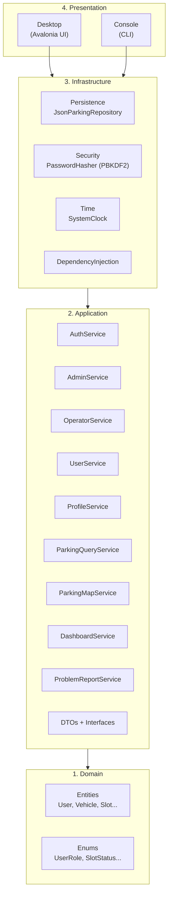
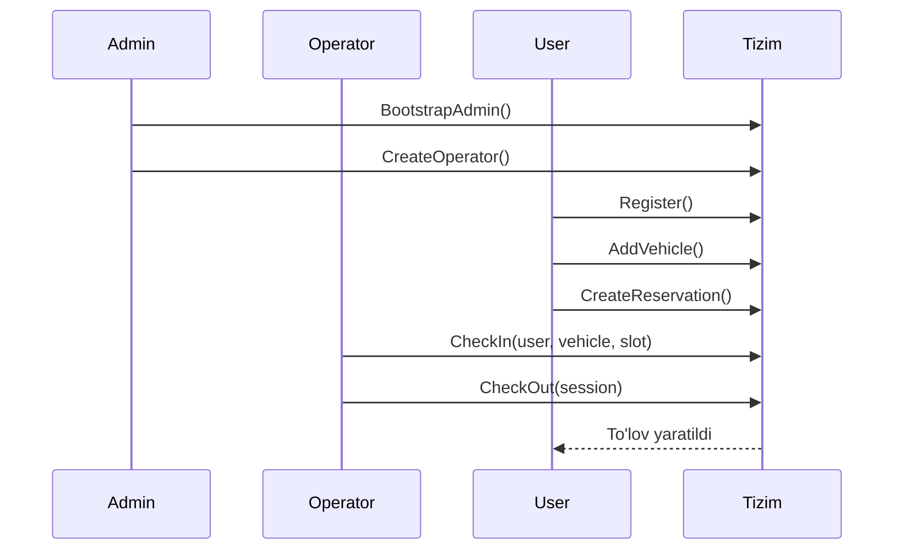

# Smart Parking Management System (Parking Tizimi)

Zamonaviy parking boshqaruv tizimi — **Clean Architecture**, **DDD** va **.NET 8** asosida.  
Avalonia Desktop va Konsol (CLI) interfeyslari biznes mantiqdan to‘liq ajratilgan.

---

## Mundarija

1. [Arxitektura](#-arxitektura)
2. [Loyiha strukturasi](#-loyiha-strukturasi)
3. [Autentifikatsiya va profil](#-autentifikatsiya-va-profil-boshqaruvi)
4. [Rollar ierarxiyasi](#-rollar-ierarxiyasi)
5. [Ruxsatlar matritsasi](#-ruxsatlar-matritsasi)
6. [Biznes oqimi (ketma-ketlik)](#-biznes-oqimi-ketma-ketlik)
7. [Oldingi xatolar va tuzatishlar](#-oldingi-xatolar-va-tuzatishlar)
8. [Ishga tushirish](#-ishga-tushirish)
9. [Best practices](#-best-practices)
10. [Rivojlantirish yo‘li](#-rivojlantirish-yoli)

---

## Arxitektura

Loyiha 4 ta qatlamga ajratilgan. Tashqi qatlamlar ichkariga bog‘lanadi; **Domain** hech narsaga bog‘lanmaydi.



### Qatlamlar vazifasi

| Qatlam | Vazifa | Bog‘lanish |
|--------|--------|------------|
| **Domain** | Biznes obyektlari, enumlar | Hech narsaga bog‘lanmaydi |
| **Application** | Use-case servislar, DTO, interfeyslar | Faqat Domain |
| **Infrastructure** | JSON saqlash, parol hash, DI | Application interfeyslarini implement qiladi |
| **Presentation** | UI, foydalanuvchi bilan ishlash | Infrastructure orqali servislarni chaqiradi |

---

## Loyiha strukturasi

```
ParkingTizimi/
├── ParkingTizimi.sln
├── global.json                          # .NET SDK 8.0.422
├── run-console.sh
├── run-desktop.sh
├── data/
│   └── parking-data.json              # Runtime da yaratiladi
│
├── src/
│   ├── Domain/                         # 1. Domain
│   │   ├── Entities/
│   │   └── Enums/
│   │
│   ├── Application/                    # 2. Application
│   │   ├── Common/
│   │   ├── DTOs/
│   │   │   ├── Auth/
│   │   │   ├── Profile/
│   │   │   ├── Map/
│   │   │   ├── Dashboard/
│   │   │   └── Problems/
│   │   ├── Interfaces/
│   │   ├── Services/
│   │   ├── Internal/
│   │   ├── Models/
│   │   ├── DependencyInjection/
│   │   └── ParkingAppServices.cs
│   │
│   ├── Infrastructure/                 # 3. Infrastructure
│   │   ├── Persistence/
│   │   ├── Security/
│   │   ├── Time/
│   │   └── DependencyInjection/
│   │
│   ├── Desktop/                        # 4. Presentation — Desktop
│   │   ├── MainWindow.axaml / .cs
│   │   ├── ParkingFloorRenderer.cs
│   │   ├── ZoneMapRenderer.cs
│   │   ├── ProblemReportWindow.axaml
│   │   └── App.axaml.cs
│   │
│   └── Console/                        # 4. Presentation — CLI (namespace: Cli)
│       └── Program.cs
│
└── tests/
    └── Application.Tests/
```

---

## Autentifikatsiya va profil boshqaruvi

### Autentifikatsiya oqimi

```
Mehmon
  │
  ├─► BootstrapAdmin (faqat bir marta, admin yo‘q bo‘lsa)
  │
  ├─► Login ──► AuthService.Login ──► CurrentUserService.SetCurrentUser
  │
  └─► Register (faqat admin mavjud bo‘lsa) ──► UserRole.User
```

| Servis | Metod | Vazifa |
|--------|-------|--------|
| `IAuthService` | `Login` | Username + parol tekshirish |
| `IAuthService` | `Register` | Yangi **User** yaratish (admin mavjud bo‘lishi shart) |
| `IAuthService` | `HasAdmin` | Admin bor-yo‘qligini tekshirish |
| `IAdminService` | `BootstrapAdmin` | Birinchi admin yaratish |
| `IAdminService` | `CreateOperator` | Admin tomonidan operator yaratish |
| `ICurrentUserService` | `SetCurrentUser` / `SignOut` | Desktop/Console sessiyasi |

### Profil boshqaruvi

| Servis | Metod | Vazifa |
|--------|-------|--------|
| `IProfileService` | `GetProfile` | Joriy foydalanuvchi ma’lumotlari |
| `IProfileService` | `UpdateProfile` | Telefon raqamni yangilash |
| `IProfileService` | `ChangePassword` | Joriy parolni tekshirib, yangisini o‘rnatish |

**Xavfsizlik:**
- Parollar **PBKDF2-SHA256** (100 000 iteratsiya) bilan hashlanadi
- Telefon: `+998XXXXXXXXX` formati majburiy
- Parol: kamida 6 belgi

---

## Rollar ierarxiyasi

```
Admin (Ma'mur)
  │
  ├── Operator yaratadi
  │     │
  │     └── Check-in / Check-out bajaradi
  │
  └── Tizimni nazorat qiladi (foydalanuvchilar, slotlar, statistika)

User (Foydalanuvchi)
  │
  ├── O‘zi ro‘yxatdan o‘tadi (admin mavjud bo‘lgandan keyin)
  ├── Avtomobil qo‘shadi
  ├── Bron yaratadi / bekor qiladi
  └── To‘lovlar tarixini ko‘radi
```

### Har bir rol vazifasi

| Rol | Kim yaratadi? | Asosiy vazifalar |
|-----|---------------|------------------|
| **Admin** | Bootstrap (birinchi marta) | Operator yaratish, barcha foydalanuvchilarni ko‘rish, tizim statistikasi |
| **Operator** | Admin | **Faqat** check-in va check-out |
| **User** | O‘zi (Register) | Avtomobil, bron, to‘lovlar |

> **Muhim:** Admin operatsion ishlar (check-in/out) **bajarmaydi**. Operator admin panelini **ko‘rmaydi**. User faqat o‘z ma’lumotlari bilan ishlaydi.

---

## Ruxsatlar matritsasi

| Amal | Admin | Operator | User | Mehmon |
|------|:-----:|:--------:|:----:|:------:|
| Bootstrap admin | ✅ (bir marta) | ❌ | ❌ | ✅ |
| Login | ✅ | ✅ | ✅ | ✅ |
| Register (User) | ❌ | ❌ | ❌ | ✅* |
| Operator yaratish | ✅ | ❌ | ❌ | ❌ |
| Avtomobil qo‘shish | ❌ | ❌ | ✅ | ❌ |
| Bron yaratish/bekor | ❌ | ❌ | ✅ | ❌ |
| Check-in | ❌ | ✅ | ❌ | ❌ |
| Check-out | ❌ | ✅ | ❌ | ❌ |
| Profil yangilash | ✅ | ✅ | ✅ | ❌ |
| Parol o‘zgartirish | ✅ | ✅ | ✅ | ❌ |
| Barcha foydalanuvchilar | ✅ | ❌ | ❌ | ❌ |

*\* Register faqat admin mavjud bo‘lganda ishlaydi.*

---

## Biznes oqimi (ketma-ketlik)

To‘g‘ri ish tartibi — **bu ketma-ketlik buzilsa, tizim xato ishlaydi**:

```
1. Admin yaratish (BootstrapAdmin)
        ↓
2. Admin → Operator yaratish (CreateOperator)
        ↓
3. User ro'yxatdan o'tish (Register)
        ↓
4. User → Avtomobil qo'shish → Bron yaratish
        ↓
5. Operator → Check-in → Check-out → To'lov
```



---

## Oldingi xatolar va tuzatishlar

Eski loyihada quyidagi xatolar bor edi — **yangi arxitekturada tuzatildi**:

| # | Xato | Eski holat | Yangi tuzatish |
|---|------|------------|----------------|
| 1 | Admin check-in/out qilardi | `HasStaffAccess` (Admin + Operator) | `IsOperator` — **faqat Operator** |
| 2 | Admin Operator panelini ko‘rardi | UI da Admin ham Operator tab ko‘rardi | Operator panel **faqat Operator** uchun |
| 3 | Register admin siz ishlaydi | Har kim ro‘yxatdan o‘tardi | Register **admin mavjud bo‘lganda** ishlaydi |
| 4 | Console menyu tartibi noto‘g‘ri | Register → Login → Admin | Admin → Login → Register |
| 5 | Monolit servis | `ParkingSystemService` (550+ qator) | 7 ta alohida servis (SRP) |
| 6 | Profil yo‘q edi | UpdateProfile/ChangePassword yo‘q | `IProfileService` qo‘shildi |
| 7 | User ops da rol tekshiruvi yo‘q | Admin ham AddVehicle qila olardi | `IsEndUser` guard qo‘shildi |
| 8 | Core qatlam chalkash | Domain + biznes bir joyda | Clean Architecture qatlamlari |

---

## Ishga tushirish

### Talablar

- .NET SDK **8.0** (`global.json` da 8.0.422)
- Linux / Windows / macOS

### Build va test

```bash
export PATH="$HOME/.dotnet:$PATH"

dotnet build
dotnet test
```

### Desktop (Avalonia)

```bash
./run-desktop.sh
```

### Console (CLI)

```bash
./run-console.sh
```

### Birinchi marta ishlatish

**Variant A — Demo rejim (PBL taqdimoti uchun tavsiya etiladi):**

1. Eski ma'lumot bo'lsa: `rm data/parking-data.json`
2. `./run-desktop.sh` — avtomatik: 6 hudud, 72 slot, demo foydalanuvchilar
3. Demo hisoblar:

| Rol | Login | Parol |
|-----|-------|-------|
| Admin | `admin` | `Admin123!` |
| Operator | `operator` | `Operator123!` |
| User | `demo_user` | `User123!` |

**Variant B — Qo'lda sozlash:**

1. Desktop yoki Console oching
2. **Admin yarating** (username, parol, telefon)
3. Admin sifatida login qiling → **Operator yarating**
4. Chiqing → **User sifatida ro'yxatdan o'ting**
5. User login → avtomobil qo'shing → bron qiling
6. Operator login → check-in / check-out

---

## Desktop interfeys imkoniyatlari

| Bo'lim | Tavsif |
|--------|--------|
| **Dashboard** | Bandlik %, daromad, geo-xarita, 7 kunlik daromad grafigi |
| **Parking joylar** | Zona pilllari, A/B/C qatorli slot grid |
| **Bron** | Geo-qidiruv, bron bekor qilish, to'lovlar tarixi |
| **Operator** | ComboBox orqali check-in/out |
| **Admin** | Slot OutOfService, muammolarni yopish |

---

## PBL 2 — loyiha xususiyatlari

- Clean Architecture, rol-based access, geo-parking (Haversine)
- DashboardService analitika, ProblemReport workflow
- 12 ta unit test, Avalonia 11 zamonaviy UI

---

## Best practices

### Arxitektura

- **Dependency Inversion:** Presentation → Infrastructure → Application → Domain
- **Qisqa loyiha nomlari:** Papka va assembly nomlari `Domain`, `Application`, `Infrastructure` — repo nomi allaqachon kontekst beradi
- **Namespace = qatlam:** `Domain.Entities`, `Application.Services`, `Infrastructure.Persistence`
- **Console loyihasi:** papka `Console`, namespace `Cli` (`System.Console` bilan conflict oldini olish uchun)
- **Single Responsibility:** Har bir servis bitta vazifaga mas’ul (`AuthService`, `OperatorService`, ...)
- **Interface Segregation:** Kichik, maqsadli interfeyslar (`IAuthService`, `IProfileService`)
- **Facade pattern:** `ParkingAppServices` — presentation qatlami uchun bitta kirish nuqtasi

### Xavfsizlik

- Parol hech qachon plain-text saqlanmaydi (PBKDF2)
- Rol tekshiruvi **servis qatlamida** (UI ga ishonib qolmaslik)
- `OperationResult<T>` — xatolarni exception o‘rniga strukturali qaytarish

### Kod sifati

- DTO lar request/response uchun alohida (`LoginRequest`, `AuthResult`)
- `internal` helperlar (`ParkingStateHelper`, `UserRegistration`) — public API ni toza saqlash
- Testlar: rol cheklovlari, admin bootstrap, profil yangilash

### Ma’lumotlar

- Hozir: **JSON** fayl (`data/parking-data.json`)
- Kelajakda: SQLite / PostgreSQL (`Infrastructure/Persistence` ga qo‘shish oson)

---

## Rivojlantirish yo‘li

| Bosqich | Vazifa | Holat |
|---------|--------|-------|
| 1 | Clean Architecture + rollar | ✅ Tayyor |
| 2 | Auth + Profile | ✅ Tayyor |
| 3 | Desktop UI (Dashboard, xarita, parking grid) | ✅ Tayyor |
| 4 | Analitika va hisobotlar (DashboardService) | ✅ Tayyor |
| 5 | Muammo xabar qilish tizimi | ✅ Tayyor |
| 6 | Demo ma'lumotlar (72 slot, 6 hudud) | ✅ Tayyor |
| 7 | SQLite migratsiyasi | 📋 Reja |
| 8 | REST API qatlami | 📋 Reja |
| 9 | JWT token (web uchun) | 📋 Reja |

---

## Servislar xaritasi

| Servis | Fayl | Metodlar |
|--------|------|----------|
| AuthService | `Services/AuthService.cs` | Login, Register, HasAdmin |
| AdminService | `Services/AdminService.cs` | BootstrapAdmin, CreateOperator |
| OperatorService | `Services/OperatorService.cs` | CheckIn, CheckOut |
| UserService | `Services/UserService.cs` | AddVehicle, CreateReservation, CancelReservation |
| ProfileService | `Services/ProfileService.cs` | GetProfile, UpdateProfile, ChangePassword |
| ParkingQueryService | `Services/ParkingQueryService.cs` | GetSlots, GetAllUsers, ... |
| ParkingMapService | `Services/ParkingMapService.cs` | GetAllZones, SearchNearby, GetZoneSlots |
| DashboardService | `Services/DashboardService.cs` | GetOverview (statistika, daromad) |
| ProblemReportService | `Services/ProblemReportService.cs` | Report, GetOpenReports, Resolve |
| ParkingStateStore | `Services/ParkingStateStore.cs` | InitializeAsync, PersistAsync |

---

## Litsenziya

MIT License — `LICENSE` faylini ko‘ring.
